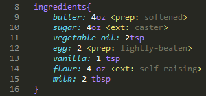

<h1> </h1>
<h3>Worlds best programming language for cooking!</h3>

<h4>Cook is a description language for all types of activities related to cooking. Possibilites include:</h4>

<ul>
    <li>Creating a Standard for Recipes</li>
    <li>Ofering new standard tools for recipes.</li>
    <li>Connecting multiple devices to fufill a role in a kitchen.</li>
    <li>Ofering commands for cooking robots!</li>
</ul>

#DOCUMENTATION
<h2>Info</h2>>
The first block of COOK code needs to define descriptions for the recipe, this can be it's name (title), description, preperation time or servings.
 

    
<h2>Ingredients</h2>
<ul>
    <li>Every recipe needs ingredients, in COOK we need to define our second block as one to set all of the elements that make the recipe.</li>
    <li>COOK units can be in imperial or metric systems, this is because there will be integrated conversions systems in all of it's compilers.</li>
    <li>You can detail information about the ingredient used with information like: preperation (prep), brand or extras (ext)</li>
</ul>

<h2>Directions</h2>
<ul>
    <li>The final block of COOK code is the one containing all of the directions needed to prepare the recipe. </li>
    <li>Each object is seperetely defined for each component of a recipe. Inside the object identifier is where all of the directions will be positioned.</li>
    <li>Action keywords (RED) are the ones that tell what is going to be done to another object or ingredient (Ex: bake; place; mix; stir; heat).</li>
    <li>Condition keywords (VIOLET) complement the actions by telling parameters for the action to be sucessfull (Ex: on; until).</li>
    <li>Some actions are aplied to more than one object, in this case they are put inside braces and seperated by commas. Ex: mix(flour,sugar,salt,egg)</li>
    <li>You can be more specific to how an action will be made by defining variables like 'size' 'distance' or 'extras'.</li>
    <li>The last action of COOK code should always be 'serve' followed by the object that will be served.</li>
</ul>

# EXAMPLES
<ul>
    <h3><li>Cookie Recipe</li></h3>
</ul>
